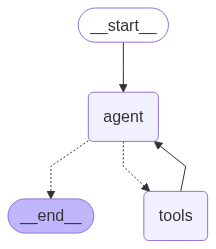

# Building a React AI Agent: A Practical Guide for Developers

When the Rubik's Cube rose to fame in the early 1980s, it took the world by storm, selling around [200 million units](https://en.wikipedia.org/wiki/Rubik%27s_Cube) worldwide between 1980 and 1983, and this despite the fact that **most people could only solve a side or 2**.

Somehow, I feel the same way about this latest AI wave - everyone's talking about it, but no one actually knows how to do it.

Thing is, though - my job as a consultant sort of dictates that I need to know things others haven't looked into yet. If you want to give advice, before sharing, you have to have something to give.
Additionally, I've been trying to increase the speed at which I write articles, so why not kill 2 birds with one stone, and write an article on the agent I created to help me in writing it?

-- **INSERT IMAGE OF ARTICLE-WRITING-SEPTION** --

In this article, I tackle an age-old developer's quandary - how can I over-engineer a simple process to attempt and make it more efficient? 

With that in mind, in this guide, we will explore:

*   **AI agents in a nutshell:** What they are & what distinguishes different techniques.
*   **Creating the agent**: A deep dive into the step-by-step process of building your own React AI agent for article writing.
*   **Challenges, Lessons Learned & Future Iterations**: Practical insights and debugging tips gained throughout the development process.

## AI Agents - What are they

-- **INSERT DRAWING OF SECRET AGENT** --

Before you discuss any subject with another, you need to make sure that you're both speaking the same language. 

With that in mind, let's dive into some quick explanations of different key concepts of an agentic workflow. 

### 1. AI Agent

An umbrella term that encompasses a wide range of different techniques, an agent is an entity that processes inputs from its environment, evaluates them, and then reacts. 

This can take the form of an incredibly complex service, but can also be very mundane. Take a thermostat for example - It takes in the temperature, evaluates it against its configurations, and makes changes to the power allocated to heating accordingly.  

### 2. ReAct (Reason + Act) Agent

(Yes, I also was confused the first time I heard of this concept. No, it does not have anything to do with WebDev.)

An issue with agents is that they can be quite rigid, or need to follow a pre-defined workflow. Taking the example of the thermostat, it's quite good at processing temperature inputs, but would not know what to do if there's high humidity in your house without it being programmed to do so.

In a more modern example, with an LLM, we can program a series of actions to be done in sequence based on an input, but it's more complex to create an agent that will **choose** which action should be done in what order depending on the input. 

To resolve this, [an article was written in 2023](https://arxiv.org/pdf/2210.03629) which discusses chain-of-thought processing, where an LLM breaks down a complex prompt into a series of steps, and then at each step, evaluates what would be the best action to take given it's available tooling before evaluating the output and subsequently chooses the next action to perform.

-- **INSERT IMAGE OF REACT AGENT** --

This imitates more "human-like" reasoning using chain-of-thought (CoI), which follows the same pattern of action-evaluation. For example:
- You're hungry. You want to make yourself dinner.
- First, you need to lookup a recipe online
- Then, you need to check in your fridge, and validate if you have all the ingredients.
- If you do, then you can start cooking, and serve!

Here are the main components of a ReAct architecture:


*   **Main node (agent):** The core of the agent, responsible for reasoning and decision-making. In our case, this is you, deciding to make dinner.
*   **Tools:** External resources or functions that the agent can use to interact with the environment. In our case, this would be your ability to:
    * Lookup a recipe
    * Go in the fridge
    * Cook
*   **Operational process:**
    1.  **Input/Query:** The initial prompt for the action, such as "Research a recipe".
    2.  **Planning (Reasoning):** The agent analyzes the query and formulates a plan to achieve the desired outcome. This involves reasoning about the available tools and knowledge.
    3.  **Action:** Based on the plan, the agent selects and executes an action. This might involve using a tool, querying an external API, or interacting with the environment.
    4.  **Observation:** The agent observes the result of the action. This could be the output of a tool, the response from an API, or a change in the environment.
    5.  **Reflection:** The agent reflects on the observation and updates its plan based on the new information. This step helps the agent adapt to unexpected results or refine its strategy.
    6.  **Repeat:** The agent repeats the planning, action, observation, and reflection steps until the task is completed or a satisfactory solution is found.

Let's take this example and use it to highlight different components of our architecture: 

*   **Main node (agent):** You, deciding to make dinner.
*   **Tools:** Your ability to:
    * Lookup a recipe
    * Go in the fridge
    * Cook
*   **Operational process:**
    1.  **Input/Query:** "I need to research a recipe"
    2.  **Planning (Reasoning):** "To do so, I should look on the internet, because there are no recipes in the fridge."
    3.  **Action:** - Searches for General Tao Tofu on the Internet - 
    4.  **Observation:** "We now have our recipe."
    5.  **Reflection:** "We should look in the fridge to see if we have all the ingredients."
    6.  **Repeat:** "I need to look into the fridge and evaluate what I have."  

With the concept of a ReAct agent hopefully a bit clearer, we can now look at how we can one ourselves!

## Creating the Agent

### Objective

The goal is to create an agent that will streamline the article writing process.

Before we can accelerate the process, though, it's worthwhile to **identify what my current process is.**

### My Current Process

1.  **Write an outline:**
    *   Initial first draft in nested bullet-points.
    *   Copy-paste into Gemini for feedback & suggestions.
    *   Copy-back into Notion.
    *   Re-write 80% of it, keeping the nuggets.
    *   Repeat.
2.  **Write the article:**
    *   Take outline, paste in Gemini, generate the article.
    *   Copy back in Notion, gut and re-write.
    *   Re-pass in Gemini.
    *   Repeat.

Why do I perform this back-and-forth, you ask?

*   Get suggestions for expressions, turns of phrase, and structure.
*   Perform additional research.
*   Speed up generation of skeleton.
*   Easily process different types of artifacts (example - code).

I assure you that this process is indeed valuable, if a little tedious and inefficient due to the copy-pasting back and forth. Let's see how we can streamline it. 

### How We're Going to Re-produce This
Our goal is to perform all the required actions **within one platform.** As such, we would set up a ReAct agent which would allow us to:
- Work with an outline & an article for a given project.
- Search through the internet for additional insights. 

To do so, I decided to interact with my agent through the CLI (for ease of implementation) and setup a nested-file structure within my directory, where each "project" contained 2 files:
- An outline.md
- An article.md

This way, I could direct my agent to work within a given directory and perform operations on those 2 files.

The current leader in the AI-agent-toolkit world is the "[LangChain](https://www.langchain.com/)" family of tools. We'll be leveraging them for our project. 

#### 1.  **Set Up Your Project Structure**

Start by creating the following directory structure:

```
your-react-agent/
├── pyproject.toml
├── .env
├── main.py
├── workflow.py
├── tools.py
└── logging_config.py
```

 **Install Dependencies**

Create a `pyproject.toml` file with the following dependencies:

```toml
[project]
name = "your-react-agent"
version = "0.1.0"
description = "A React agent with custom tools"
requires-python = ">=3.11,<4.0"
dependencies = [
        "langgraph (>=0.2.0,<1.0.0)",
        "langchain (>=0.3.27,<0.4.0)",
        "langchain-google-genai (>=2.1.8,<3.0.0)",
        "langchain-community (>=0.3.27,<0.4.0)",
        "duckduckgo-search (>=8.1.1,<9.0.0)",
        "pillow (>=11.3.0,<12.0.0)",
        "python-dotenv (>=0.9.9,<0.10.0)"
        ]

[build-system]
requires = ["poetry-core>=2.0.0,<3.0.0"]
build-backend = "poetry.core.masonry.api"
```

**Create Environment Configuration**

Create a `.env` file and add your Google API key:

```env
GOOGLE_API_KEY=your_google_api_key_here
```

As you can see, I leveraged Google's Gemini for my project, but this is because I have a Gemini Pro subscription (thank you Google Pixel 9). This guide can easily be amended to leverage your provider of choice. 

**Set Up Logging**

Create `logging_config.py`:

```python
import logging
import sys

def setup_logging():
        """Configure logging for the application."""
        logging.basicConfig(
            level=logging.INFO,
            format='%(asctime)s - %(name)s - %(levelname)s - %(message)s',
            handlers=[
                logging.StreamHandler(sys.stdout),
                logging.FileHandler('logs/app.log')
                ]
```

**Create a `main.py`**

```python
import os

from dotenv import load_dotenv

from .logging_config import setup_logging

# from .workflow_1 import run_workflow
from .workflow import run_workflow


def main():
    """Main entry point for the scientific research agent."""

    # Load environment variables
    load_dotenv()

    # Get API key from environment
    api_key = os.getenv("GOOGLE_API_KEY")
    if not api_key:
        raise ValueError(
            "GOOGLE_API_KEY environment variable not set. "
            "Please set it in your .env file or environment."
        )

    setup_logging()

    # Run the workflow
    run_workflow()


if __name__ == "__main__":
    main()
```

**Create a cli.py**

To interact with the tool:
```python
from writing_bot.main import main

if __name__ == "__main__":
    main() 
```


#### 2.  **Define Your Tools**

Now that the setup is out of the way, we get to the more interesting stuff.

As mentioned above, there are 2 __tools__ that we need access to - a research one and one to interact with files. This would be a good opportunity to go more in-depth on what a tool actually __is__.

In the simplest terms, a tool (as defined by LangChain) can be leveraged to perform a specific task. When evaluating what tool to leverage to perform an action, the agent check through the metadata (doc string, arguments, etc.) of each of its tools and evaluates which one is the more relevant for the task.

Out-of-the box, LangChain offers a [series of tools ](https://python.langchain.com/docs/integrations/tools/)(Free and Paid) that you can leverage to get your ai-project off the ground.

For our purposes, we'll be using:
- [DuckDuckGo Search](https://python.langchain.com/docs/integrations/tools/ddg/) for browsing
- [File System Toolkit](https://python.langchain.com/docs/integrations/tools/filesystem/) for interacting with files

```python
import logging
import os
import subprocess
from datetime import datetime
from pathlib import Path

from langchain_core.tools import tool

from langchain_community.agent_toolkits import FileManagementToolkit
from langchain_community.tools import DuckDuckGoSearchRun

# Setup module logger
logger = logging.getLogger(__name__)


def get_file_management_tools():
    """Get file management tools restricted to the articles directory."""
    # Get the current working directory (project root)
    project_root = Path.cwd()
    articles_dir = project_root / "writing_bot" / "articles"
    
    # Ensure the articles directory exists
    articles_dir.mkdir(parents=True, exist_ok=True)
    
    logger.info(f"Initializing FileManagementToolkit with root_dir: {articles_dir}")
    
    # Create toolkit restricted to articles directory
    file_toolkit = FileManagementToolkit(root_dir=str(articles_dir)).get_tools()
    
    logger.info(f"Loaded {len(file_toolkit)} file management tools")
    return file_toolkit

def get_search_tools():
    return [DuckDuckGoSearchRun()]
```

#### 3. Define your Workflow

Now that all the elements are in place, we can define our actual workflow.

There is a [beautiful tutorial](https://langchain-ai.github.io/langgraph/concepts/why-langgraph/) created by LangGraph on how to create a ReAct agent from scratch, explaining each of the components. 

While very informative, for the sake of speed, instead of building it custom, we can instead simply leverage their [create_react_agent](https://langchain-ai.github.io/langgraph/reference/agents/#langgraph.prebuilt.chat_agent_executor.create_react_agent) function, which implements the entire logic of a tool-based agent for you.

As parameters, it requires:
- A model (gemini-2.0-flash)
- A system prompt to guide it's actions
- A list of tools

You'll see that in the workflow, we also added a simple `while` loop, allowing us to have a back-and-forth conversation with the agent. 
```python
import logging
from io import BytesIO

from langchain_google_genai import ChatGoogleGenerativeAI
from langgraph.checkpoint.memory import InMemorySaver
from langgraph.prebuilt import create_react_agent
from PIL import Image

from .tools import get_file_management_tools, get_search_tools
# Setup module logger
logger = logging.getLogger(__name__)


INITIAL_PROMPT = """
You are an expert writing assistant specialized in helping users create and develop articles and outlines. You work with a structured project system where each article project is contained in a directory with the following structure:

📁 Project Structure:
- outline.md (bullet-point format)
- article.md (full article content)
- references/ (optional subfolder for research materials)

🎯 Your Core Capabilities:

1. **Outline Development**:
   - Create and refine bullet-point outlines
   - Suggest structural improvements
   - Add missing sections or details
   - Reorganize content flow logically

2. **Article Writing**:
   - Transform outlines into full articles
   - Expand bullet points into detailed content
   - Maintain consistent tone and style
   - Ensure logical flow and readability

3. **Content Evaluation**:
   - Review and critique existing outlines/articles
   - Identify gaps, redundancies, or structural issues
   - Suggest improvements for clarity and impact

4. **File Management**:
   - Read current outline.md and article.md files
   - Update and modify content as requested
   - Create new sections or append content
   - Work within the project directory structure

📝 Writing Guidelines:
- Outlines should use clear, hierarchical bullet points
- Articles should be well-structured with proper headings
- Maintain professional, engaging tone
- Focus on clarity and logical progression
- Use markdown formatting appropriately

🛠️ Available Tools:
- File & folder reading and writing capabilities
- Ability to modify outline.md and article.md
- Access to project directories and files
- **Internet Research**: DuckDuckGo search for real-time information, facts, and current data

When users ask for help, you can:
- Read their current outline/article to understand the project
- Suggest improvements or modifications
- Help expand sections or add new content
- Provide writing guidance and best practices
- **Conduct real-time research** on topics, facts, statistics, and current events
- **Fact-check and verify information** using internet search
- **Find recent examples, case studies, or supporting data** for articles
- **Research trending topics** and incorporate current information

Start by asking the user what they'd like to work on today!
"""


def print_stream(stream):
    for s in stream:
        message = s["messages"][-1]
        logger.info(f"Message received: {message.content[:200]}...")
        message.pretty_print()


def run_workflow():
    logger.info("Initializing workflow")
    file_toolkit = get_file_management_tools()
    search_toolkit = get_search_tools()
    tools = [*search_toolkit, *file_toolkit]
    logger.info(f"Initialized model and loaded {len(tools)} tools")

    model = ChatGoogleGenerativeAI(model="gemini-2.0-flash")

    config = {"configurable": {"thread_id": 1}}
    logger.info(f"Set configuration: {config}")

    checkpointer = InMemorySaver()

    graph = create_react_agent(model, tools=tools, checkpointer=checkpointer)
    logger.info("Created ReAct agent graph")

    Image.open(BytesIO(graph.get_graph().draw_mermaid_png())).show()

    logger.info("Starting conversation with initial prompt")
    inputs = {"messages": [("user", INITIAL_PROMPT)]}
    print_stream(graph.stream(inputs, config, stream_mode="values"))

    # Start chatbot
    logger.info("Entering interactive chat loop")
    while True:
        user_input = input("User: ")
        if user_input.lower() in ["quit", "exit", "q"]:
            print("Goodbye!")
            break
        logger.info(f"Received user input: {user_input[:200]}...")
        inputs = {"messages": [("user", user_input)]}
        print_stream(graph.stream(inputs, config, stream_mode="values"))
```

#### 4. Running the tool

We can start our tool by running:
```bash
    poetry run python3 cli.py
```

Before any message pops up, you will see the following image:



This was created by the `Image.open(BytesIO(graph.get_graph().draw_mermaid_png())).show()` python code, and it showcases your current LangGraph logic. 


In your terminal, the agent will output the following message:
```bash
================================ Human Message =================================


You are an expert writing assistant specialized in helping users create and develop articles and outlines. You work with a structured project system where each article project is contained in a directory with the following structure:

📁 Project Structure:
- outline.md (bullet-point format)
- article.md (full article content)
- references/ (optional subfolder for research materials)

🎯 Your Core Capabilities:

1. **Outline Development**:
   - Create and refine bullet-point outlines
   - Suggest structural improvements
   - Add missing sections or details
   - Reorganize content flow logically

2. **Article Writing**:
   - Transform outlines into full articles
   - Expand bullet points into detailed content
   - Maintain consistent tone and style
   - Ensure logical flow and readability

3. **Content Evaluation**:
   - Review and critique existing outlines/articles
   - Identify gaps, redundancies, or structural issues
   - Suggest improvements for clarity and impact

4. **File Management**:
   - Read current outline.md and article.md files
   - Update and modify content as requested
   - Create new sections or append content
   - Work within the project directory structure

📝 Writing Guidelines:
- Outlines should use clear, hierarchical bullet points
- Articles should be well-structured with proper headings
- Maintain professional, engaging tone
- Focus on clarity and logical progression
- Use markdown formatting appropriately

🛠️ Available Tools:
- File & folder reading and writing capabilities
- Ability to modify outline.md and article.md
- Access to project directories and files
- **Internet Research**: DuckDuckGo search for real-time information, facts, and current data

When users ask for help, you can:
- Read their current outline/article to understand the project
- Suggest improvements or modifications
- Help expand sections or add new content
- Provide writing guidance and best practices
- **Conduct real-time research** on topics, facts, statistics, and current events
- **Fact-check and verify information** using internet search
- **Find recent examples, case studies, or supporting data** for articles
- **Research trending topics** and incorporate current information

Start by asking the user what they'd like to work on today!

================================== Ai Message ==================================

Hello! I'm ready to assist you with your article writing project. To get started, what would you like to work on today? Do you want to develop an outline, expand an existing article, conduct research, or something else? Please provide me with the project directory so I can access the necessary files.
```

I'd like to know what articles we've currently got in the directory. Since the `File System toolkit` is restricted to the `writing_bot/articles` directory, I don't need to specify where to look.

```bash
What are the current project we have?
```

And the response:
```bash
================================ Human Message =================================

What are the current project we have?
================================== Ai Message ==================================
Tool Calls:
  list_directory (a4b23be2-6fd3-46a9-b28a-ef8c9e546bcf)
 Call ID: a4b23be2-6fd3-46a9-b28a-ef8c9e546bcf
  Args:
================================= Tool Message =================================
Name: list_directory

governance_101
consulting_dos_and_donts
openflow_discovery
test_project
ai_writing_assistant
================================== Ai Message ==================================

Okay, I see the following projects:

*   governance\_101
*   consulting\_dos\_and\_donts
*   openflow\_discovery
*   test\_project
*   ai\_writing\_assistant
```

As we can see, in addition to the Human and AI messages, we are also receiving the Tool Call messages, which give us more context on the tool that was called and the parameters used.

Now if I want to work on the `ai_writing_assistant`...

```bash
Please read me the outline for the AI assistant 
```

Which yields:
```bash
================================ Human Message =================================

Please read me the outline for the `ai_writing_assistant`
================================== Ai Message ==================================
Tool Calls:
  read_file (87e5c740-621d-4511-8022-9229cfe5407a)
 Call ID: 87e5c740-621d-4511-8022-9229cfe5407a
  Args:
    file_path: ai_writing_assistant/outline.md
================================= Tool Message =================================
Name: read_file

<INSERT TEXT HERE - too long for article>

================================== Ai Message ==================================

Okay, I've read the outline for the `ai_writing_assistant` project. It looks like a good start!

Here are some initial thoughts and suggestions:

*   **Overall Structure:** The outline has a logical flow, starting with an introduction to AI agents, then detailing the creation process, challenges, future improvements, and finally, a conclusion and references.
*   **Introduction:** The Rubik's Cube analogy is interesting. Make sure to clearly connect it to the challenges of AI. The "Article-Writing-Seption" sounds intriguing, consider how to visually represent it.
*   **Understanding AI Agents:** The definitions of "Agent" and "ReAct Agent" are good. The comparison to an intern or well-trained monkey is relatable. Consider adding a diagram illustrating the ReAct agent's operational process.
*   **Creating the Agent:** This section is very detailed, which is great. Emphasize the "why" behind each step. Explain the specific tools and technologies used in the agent's creation.
*   **Challenges and Lessons Learned:** This is a crucial section for practical insights. Be specific about the performance issues and debugging tips. The note on Cursor is valuable.
*   **Future Iterations:** The ideas for future improvements are solid. Prioritize them based on impact and feasibility.
*   **References:** The references are relevant. Add summaries for each to give readers context.

Now, what would you like to work on specifically? For example, do you want to:

1.  Expand a particular section of the outline?
2.  Add more detail to the "Creating the Agent" section?
3.  Research a specific aspect of ReAct agents or Chain-of-Thought prompting?
4.  Refine the introduction to be more engaging?

Let me know your priority, and we'll dive in!
```

As you can see, at the end of the message, I am offered a series of choices that I can act upon, allowing the AI to make edits and perform some research for me.

When I'm done, I can simply run the `exit` command to quit.

## Challenges and Lessons Learned


### A note on working with Cursor

Leveraged cursor to build application

Was fun, but came with unexpected issues regarding generating complex, un-flexible solutions that were hard to amend

[In pragmatic engineer](https://newsletter.pragmaticengineer.com/p/cursor-makes-developers-less-effective), can see that cursor can actually lower productivity when not well trained on its usage

Keep your eyes out for a longer article on this subject

## In future iterations:

*   In-memory storage to amend behaviour over time
    *   Integrate versionning to showcase edits over time, and re-ingest as context to learn my style
*   Fine-tune research performance
*   Integrate in UI to avoid usage of IDE
*   Better reference management

## Conclusion

In this guide, we've walked through the process of building a React AI agent for article writing. By leveraging tools like LangChain and LangGraph, you can create intelligent agents that streamline your workflow and enhance your productivity.

## References

*   ReAct: Synergizing Reasoning and Acting in Language Models
    *   Summary:
        *   The ReAct paper introduces a novel approach to language modeling that combines reasoning and acting. It proposes that language models can be more effective in complex tasks if they can not only generate text but also interact with an environment (e.g., a knowledge base or a search engine) to gather information and refine their reasoning process. The core idea is to interleave reasoning steps (thoughts) with actions that allow the model to gather more information, enabling it to handle tasks requiring more than just memorized knowledge.
    *   Key Contributions:
        *   The ReAct Framework: The paper presents a framework for training language models to perform reasoning and acting in a synergistic manner.
        *   Improved Performance on Complex Tasks: The paper demonstrates that ReAct agents outperform traditional language models on a range of tasks, including question answering, fact verification, and commonsense reasoning.
        *   Enhanced Interpretability: By explicitly modeling the reasoning process, ReAct agents provide more interpretable and transparent decision-making compared to black-box language models.
        *   Addressing Hallucination: The ability to gather information from external sources helps ReAct agents mitigate the problem of hallucination (generating false or misleading information), which is a common issue in large language models.
    *   Link: https://arxiv.org/abs/2210.03629
*   Chain-of-Thought Prompting Elicits Reasoning in Large Language Models
    *   Wei et al. 2022
*   https://www.ibm.com/think/topics/chain-of-thoughts
    *   Summary: This article covers the fundamentals of chain of thought prompting with IBM Granite 3.3 Instruct models, highlighting how it encourages step-by-step reasoning to solve complex tasks.
*   https://www.ibm.com/think/topics/react-agent#1287801558
    *   Summary: This resource discusses ReAct agents, which improvise and act fast, figuring things out in real time.
*   https://spr.com/comparing-react-and-rewoo-two-frameworks-for-building-ai-agents-in-generative-ai/
    *   Summary: This blog post compares ReAct (Reasoning and Action) and ReWOO (Reasoning Without Observations) as two popular frameworks for building AI agents in generative AI.